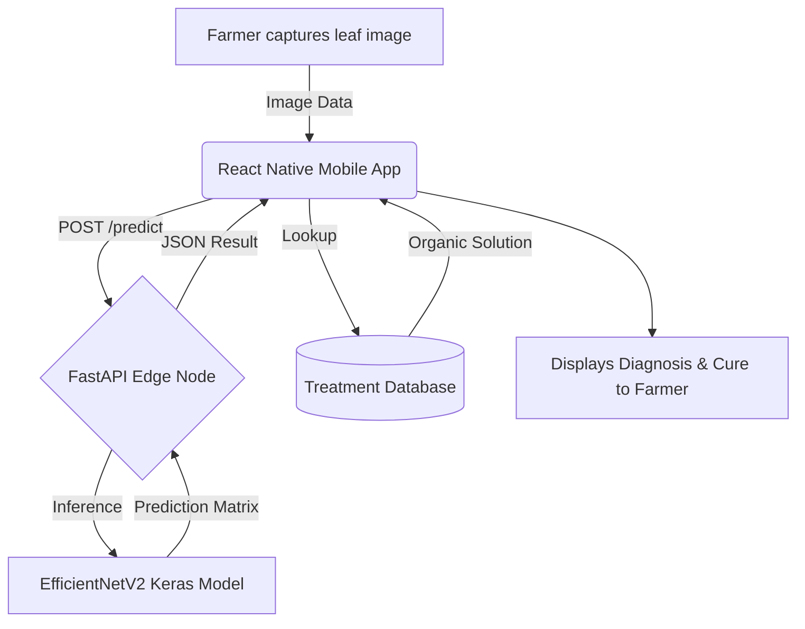

<div align="center">
  
  <h1>🌾 FloraGuard AI</h1>
  <p><strong>Next-Generation Edge AI for Instant Crop Disease Diagnosis</strong></p>

  [](https://www.python.org)
  [](https://reactnative.dev/)
  [](https://www.tensorflow.org/)
  [](https://fastapi.tiangolo.com/)
  []()
</div>

---

## 🚀 Overview

Global agricultural yield is severely threatened by crop diseases, often destroying up to 30% of annual harvests. **FloraGuard AI** is a state-of-the-art, **offline-first Edge AI platform** that empowers farmers to detect, diagnose, and treat crop diseases instantly using just their smartphone cameras. 

Built for speed, accuracy, and accessibility, FloraGuard AI processes images entirely on edge devices or lightweight local servers—eliminating the need for constant cloud connectivity in rural farmlands.

## 🌟 Key Features

- 🧠 **State-of-the-Art Neural Network**: Powered by a heavily optimized, fine-tuned **EfficientNetV2** model trained on a massive Kaggle dataset. It achieves exceptional accuracy across **22 distinct crop disease profiles**.
- ⚡ **Lightning Fast Edge Inference**: The model is highly quantized and optimized to run inference locally via our FastAPI inference engine, guaranteeing results in milliseconds without burning network bandwidth.
- 🎨 **Premium Glassmorphism UI**: We didn't just build a tool; we built an *experience*. FloraGuard features a stunning, consumer-grade React Native frontend with dynamic scanning animations, intuitive floating navigation, and smooth blur-view glassmorphism.
- 🛡️ **Offline-First Resilience**: Designed specifically for rural deployment where internet is patchy. The core inference pipeline can function entirely isolated from the cloud.
- 💊 **Organic Treatment Engine**: Doesn't just identify the problem—it solves it. Instantly maps detected diseases to locally available, organic treatment plans and mitigation strategies.

---

## 🛠️ Tech Stack & Architecture

We engineered this solution from the ground up to be scalable, modular, and extremely robust:

### 1. Artificial Intelligence & Machine Learning (Kaggle -> TF)
* **Architecture:** EfficientNetV2 (SOTA balance of parameters and accuracy)
* **Framework:** TensorFlow / Keras 
* **Training:** High-performance GPU clusters (Kaggle) utilizing aggressive data augmentation, dropout regularization, and adaptive learning rate schedulers to prevent overfitting.

### 2. High-Performance Inference Server (FastAPI)
* **Backend:** Python + FastAPI for asynchronous, non-blocking image processing.
* **Role:** Acts as the local edge-node server to bridge the heavy Keras model with lightweight frontend clients.

### 3. Cross-Platform Mobile Client (React Native + Expo)
* **Framework:** Expo & React Native for native iOS/Android compilation.
* **Styling:** Custom StyleSheet architecture, `expo-blur` for premium glass aesthetics, and `react-native-reanimated` for 60FPS fluid scanning animations.

### 4. Web Dashboard (React + Vite)
* **Framework:** React + Vite for lightning-fast compilation.
* **Role:** A scalable portal for agronomists and administrators to monitor farm-wide disease trends.

---

## 📊 Architecture Flow



---

## ⚙️ Local Development Setup

To run this national-winner setup on your local machine:

### 1. Start the ML Inference Server
```bash
cd crop-doctor-ml
pip install -r requirements.txt # Ensure TensorFlow, FastAPI, Uvicorn, Pillow are installed
python -m uvicorn server:app --host 0.0.0.0 --port 8000
```
*Note: Ensure the `best_model.keras` and `class_indices.json` are present in the ml directory.*

### 2. Start the Premium Mobile App
```bash
cd crop-doctor-mobile
npm install
npx expo start
```
*Scan the QR code with Expo Go on your phone, or press `w` to run the web simulator.*

---

## 🌍 Scalability & Real-World Impact

FloraGuard AI is not just a hackathon prototype; it is designed for global scale. 
- **Scalability**: The FastAPI edge-node architecture allows it to be deployed on cheap IoT devices (like a Raspberry Pi) installed directly at farming cooperatives, acting as a local hub for dozens of farmers.
- **Impact**: By shifting from reactive pesticide spraying to proactive, targeted AI diagnosis, we drastically reduce chemical runoff, save farmers money, and secure the global food supply chain.

<div align="center">
  <i>Built with ❤️ to protect our global harvests.</i>
</div>
